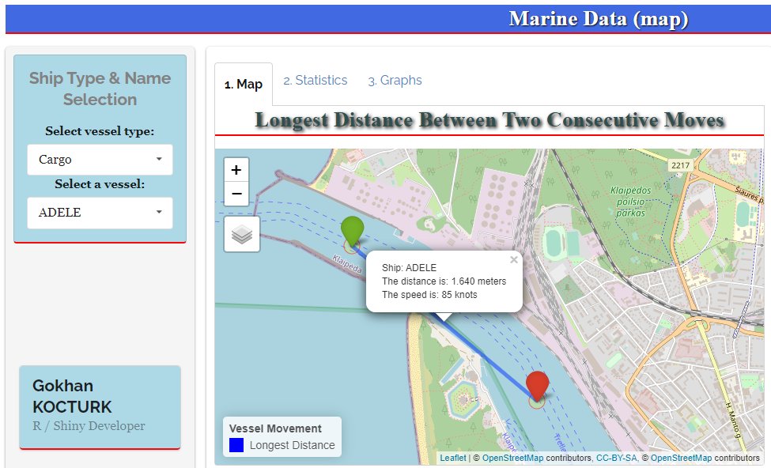
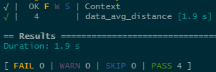
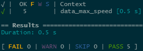
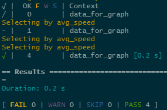
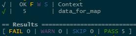

<!-- README.md is generated from README.Rmd. Please edit that file -->

# marinedatashiny


# Overview

Application is based on Marine data provided by APPSILON.  
  
**shiny.semantic**, **semantic.dashboard** packages, developed by
APPSILON team, are used for the application and the tests are conducted
by **testthat** package.  
  
There are two dropdown fields on SIDEBAR. Users can select ship type and
name by using these fields.  
  
**There are 3 tabs on MAIN PANEL;**  
**1. On “Map” tab:** Users can see information about a selected ship’s
longest move.  
**2. On “Statistics” tab:** Users can see summary statistics for average
distance and average speed.  
**3. On “Graphs” tab:** Users can see the fastest 5 ships for selected
ship type.

  
  

# Installation

Latest version of the application can be downloaded from
[Github](https://github.com/) repository using the following command:

``` r
# install.packages("devtools")
devtools::install_github("gokhankocturk/marinedatashiny")
```

# Package Tree

General structure of the package is as follows:

``` r
+-- data
|   \-- ships.rda
+-- DESCRIPTION
+-- LICENSE
+-- LICENSE.md
+-- man
|   +-- marineshinyapp.Rd
|   \-- selectUI.Rd
+-- marinedatashiny.Rproj
+-- NAMESPACE
+-- R
|   +-- app.R
|   +-- data_avg_distance.R
|   +-- data_avg_speed.R
|   +-- data_for_graph.R
|   +-- data_for_map.R
|   \-- select_ship.R
+-- README.md
+-- README.Rmd
+-- tests
|   +-- testthat
|   |   +-- test-data_avg_distance.R
|   |   +-- test-data_avg_speed.R
|   |   +-- test-data_for_graph.R
|   |   +-- test-data_for_map.R
|   |   \-- test-select_ship.R
|   \-- testthat.R
\-- www
    \-- overview.PNG
```

  

# Usage

Marinde data shiny app can be run in 2 ways;  
1\. Marine data shiny app is deployed on “shinyapps.io” platform and
available at
[here](https://gokhankocturk.shinyapps.io/marinedata_shinyapp/)  
2\. You can also run the app with “marineshinyapp()” function as
follows:  

``` r
library(marinedatashiny)
marineshinyapp()
```

  

# Data Description

**LAT** - ship’s latitude  
**LON** - ship’s longitude  
**SPEED** - ship’s speed in knots  
**COURSE** - ship’s course as angle  
**HEADING** - ship’s compass direction  
**DESTINATION** - ship’s destination (reported by the crew)  
**FLAG** - ship’s flag  
**LENGTH** - ship’s length in meters  
**SHIPNAME** - ship’s name  
**SHIPTYPE** - ship’s type  
**SHIP\_ID** - ship’s unique identifier  
**WIDTH** - ship’s width in meters  
**DWT** - ship’s deadweight in tones  
**DATETIME** - date and time of the observation  
**PORT** - current port reported by the vessel  
**Date** - date extracted from DATETIME  
**Week\_nb** - week number extracted from date  
**Ship\_type** - ship’s type from SHIPTYPE  
**Port** - current port assigned based on the ship’s location  
**Is\_parked** - indicator whether the ship is moving or not

# Unit Tests

For simple apps, it may be easy to remember and follow how the app
works, so that you can easily adapt new features without breaking the
existing code. But for larger apps, the structure will be complicated
and hard to follow the effects of the changes you made. At this point,
we need **unit tests** to make the process easier. As Hadley Wickham
stated *“Testing is a way to capture desired behaviour of your code, in
such a way that you can automatically verify that it keeps working the
way you expect.”*  
  
4 different unit tests are written for **marineshinyapp** by using
**testthat** package:  

## test-data\_avg\_distance.R

**Explanation**  
Users can select ship name and type from dropdown menus in
marineshinyapp. After ship name and type is selected, the distance
between two consecutive observations is calculated by using
**distHaversine()** function from **geosphere** package.  
In this unit test we check whether the distance between two consecutive
observations is calculated accurately or not.

**How to use it?**  
We run the unit test by using **test\_file()** function from
**devtools** package as follows:  

``` r
devtools::test_file("test-data_avg_distance.R")
```

**Output**  
The output of this unit test is as follows. It is a brief explanation
about how many tests are passed or failed.  


## test-data\_max\_speed.R

**Explanation**  
Users can select ship name and type from dropdown menus in
marineshinyapp.  
In this unit test we check the fastest speed between two consecutive
observations.

**How to use it?**  
We run the unit test by using **test\_file()** function from
**devtools** package as follows:  

``` r
devtools::test_file("test-data_max_speed.R")
```

**Output**  
The output of this unit test is as follows. It is a brief explanation
about how many tests are passed or failed.  


## test-data\_for\_graph.R

**Explanation**  
Users can select ship type from dropdown menu in marineshinyapp. After
ship type is selected, the average speed for each ship having the same
type is calculated and the fastest 5 ships are filtered for data
visualization.  
In this unit test we check whether “Cargo”, “Tug” and “Tanker” ship
types satisfy the requirements for data visualization or not.

**How to use it?**  
We run the unit test by using **test\_file()** function from
**devtools** package as follows:  

``` r
devtools::test_file("test-data_for_graph.R")
```

**Output**  
The output of this unit test is as follows. It is a brief explanation
about how many tests are passed or failed.  


## test-data\_for\_map.R

**Explanation**  
Users can select ship type and name from dropdown menu in
marineshinyapp. After ship name and type is selected, the distance
between two consecutive observations is calculated by using
**distHaversine()** function from **geosphere** package and 2
observations having the maximum distance is filtered for mapping. One of
these observations is located for starting point and the other one is
located for ending point on map.  
In this unit test we check whether the selected ship type and name
satisfy the desired requirements or not.

**How to use it?**  
We run the unit test by using **test\_file()** function from
**devtools** package as follows:  

``` r
devtools::test_file("test-data_for_map.R")
```

**Output**  
The output of this unit test is as follows. It is a brief explanation
about how many tests are passed or failed.  

